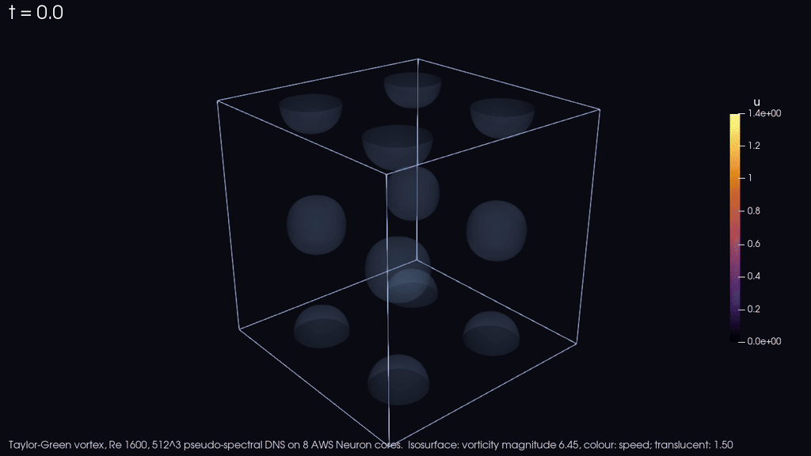

# neuron-spectral-dns



*512^3 direct numerical simulation of the Re 1600 Taylor-Green vortex to t = 10 on eight Inferentia2 NeuronCores, one
inf2.24xlarge, 27 minutes, about 3 USD of instance time. Isosurfaces of vorticity magnitude coloured by speed, rendered
from the solver's own checkpoints ([docs/media](docs/media/README.md)).*

A pseudo-spectral direct numerical simulation of the Taylor-Green vortex in a periodic box, running resident on AWS
Neuron devices (Inferentia2 and Trainium1) with kernels written in the Neuron Kernel Interface (NKI). It is a
benchmark case, not a CFD solver: periodic box, no geometry, no boundaries, incompressible, single precision. What it
shows is a complete scientific time-stepping loop on the chip: three-dimensional transforms as matmuls on the Tensor
engine, the nonlinear term, projection and Runge-Kutta update on the Vector engine, the field split over NeuronCores
with all-to-all collectives inside the kernel, a C driver on the Neuron runtime library, and exactness against fp64
references. The platform rules the kernels obey, each with the measurement behind it, are in
[docs/neuron-rules.md](docs/neuron-rules.md).

This is sample code, for non-production usage. You should work with your security and legal teams to meet your
organizational security, regulatory and compliance requirements before deployment.

## Quick start (one NeuronCore, 64^3, under two minutes from instance launch)

On a fresh instance from the Deep Learning AMI Neuron JAX (Ubuntu 24.04) in a region with Inferentia2 or Trainium1
(an inf2.xlarge is enough):

```bash
git clone --depth 1 --branch v1.0.0 https://github.com/aws-samples/sample-spectral-dns-on-aws-neuron.git
cd sample-spectral-dns-on-aws-neuron
./scripts/bootstrap.sh
```

The script activates the Neuron Python environment that ships NKI and the `neuronx-cc` compiler, builds the driver,
compiles the three Runge-Kutta stage kernels for the grid on the box, runs the Re = 1600 case to t = 10 with the
state resident on the device, and checks the result against the shipped fp64 reference. On a fresh inf2.xlarge the
check passes 1 minute 43 seconds after the launch call, and the two-rank 128^3 and 256^3 checks that follow finish
6 minutes 15 seconds after it (`docs/validation/acceptance-inf2.xlarge/`). The last lines are the check:

```
CHECK ref_E: PASS (max rel err E 2.32e-07 <= 1e-06)
CHECK ref_eps: PASS (max rel err eps 5.73e-07 <= 1e-06)
CHECK ref_peak_time: PASS (run peak 0.0130892 at t=9.179, reference 0.0130892 at t=9.179)
CHECK 64^3 R=1 tgv_64_1.csv: PASS
```

Other grids and rank counts, once the environment is sourced (RANKS > 1 uses the fused multi-core kernel with
all-to-all collectives inside the NEFF, one process per NeuronCore):

```bash
source scripts/env.sh
make check GRID=128 RANKS=1              # one NeuronCore, 128^3
make check GRID=128 RANKS=2              # both cores of an inf2.xlarge
make check GRID=256 RANKS=2              # about 3.5 minutes on an inf2.xlarge
make check-repeat GRID=256 RANKS=8       # inf2.24xlarge: check, run again, require bitwise identical statistics
make check GRID=512 RANKS=8              # inf2.24xlarge, about 30 minutes
```

## Fields for ParaView (optional)

The multi-core driver can dump the spectral state per rank at t = 0 and every `CKPT_EVERY` steps; `tools/vtk_frames.py`
turns the dumps into VTK ImageData frames (velocity, vorticity magnitude, Q criterion) with a `.pvd` time series
that ParaView opens directly:

```bash
CKPT_EVERY=41 make run GRID=256 RANKS=8
python3 tools/vtk_frames.py --prefix build/n256_r8/tgvfused_256_8 --N 256 --ranks 8 --out frames --check-analytic
```

## The Taylor-Green vortex

The Taylor-Green vortex is the standard test case of turbulence simulation: a smooth, analytic velocity field in a
periodic cube (u = sin x cos y cos z, v = -cos x sin y cos z, w = 0) left to evolve under the incompressible
Navier-Stokes equations at Reynolds number 1600. Nothing drives it; what happens is the free decay of a laminar
lattice of counter-rotating vortices into turbulence. The initial vortices stretch each other into thin vortex sheets
(t about 3 to 5), the sheets roll up and break into a tangle of small-scale vortex tubes (t about 5 to 8), the
smallest scales are most active near t = 9, where the dissipation of kinetic energy peaks, and the flow then decays.
The animation above is this sequence: the translucent surface is the initial vortex, the opaque surface the intense
vorticity that appears with the transition.

The case is used because it exercises every part of a spectral solver (transforms, the nonlinear term, dealiasing,
the pressure projection, the viscous term and the time integrator) with no boundary conditions, no geometry and no
forcing to argue about, and because its answer is known: the published 512^3 spectral results (Brachet et al. 1983;
van Rees et al., J. Comput. Phys. 2011; DeBonis, NASA/TM-2013-217850) give the dissipation peak of about 0.0128 at
t about 9. A solver that reproduces the dissipation curve at 512^3 to a fraction of a percent, with the energy budget
closed on every step, has its transforms, its arithmetic and its time stepping right. What the case does not
exercise is everything a CFD code adds around that core: walls, inflow and outflow, geometry, compressibility, and
the mesh.

The solver: Fourier collocation with 2/3-rule dealiasing, Williamson low-storage RK3, exact integration of the
viscous term, dt = 0.5 (2 pi / N), u0 = 1, nu = 1/1600. Every step the driver reads back the spectral velocity and
writes kinetic energy E, enstrophy Omega and the dissipation eps = 2 nu Omega; the dissipation curve is the
quantity the grids converge on. Method and layout: [docs/method.md](docs/method.md).

## Accuracy and performance at a glance


Both figures are generated from the retained runs and references in this repository by `tools/plot_results.py`.

## Validation contract

`make check` passes only when every criterion of the row it runs holds on the box. Every run also requires no NaN, the
analytic t = 0 energy and enstrophy (0.125 and 0.375) within 1e-6, and the energy budget -dE/dt = 2 nu Omega
within 5 percent of the peak dissipation on every step.

| grid | NeuronCores | instance | reference | tolerance |
|---|---:|---|---|---|
| 64^3 | 1 | inf2.xlarge | fp64 oracle `references/oracle_64.csv` | 1e-6 on E and eps |
| 128^3 | 1 | inf2.xlarge | fp64 oracle `references/oracle_128.csv` | 1e-6 |
| 128^3 | 2 | inf2.xlarge | 32-rank Trainium1 run `references/tgv_dist2_128_32.csv` | 4e-9 |
| 256^3 | 2 | inf2.xlarge | `references/tgv_dist2_256_32.csv` | 4e-9 |
| 256^3 | 8 | inf2.24xlarge | same, plus two runs bitwise identical on step, t, E, Omega | 4e-9 |
| 512^3 | 8 | inf2.24xlarge | `references/tgv_dist2_512_32.csv` | 2e-7 |
| 128^3, 256^3, 512^3 | 32 | trn1.32xlarge | the same 32-rank references | 4e-9, 4e-9, 2e-7 |

## Time and cost to t = 10 (measured, `docs/validation/`)

| grid | NeuronCores | instance | median ms/step | wall | on-demand cost |
|---|---:|---|---:|---:|---:|
| 64^3 | 1 | inf2.xlarge | 5.4 | 1.9 s | under 1 cent |
| 128^3 | 1 | inf2.xlarge | 21.4 | 16 s | under 1 cent |
| 128^3 | 2 | inf2.xlarge | 18.6 | 12 s | under 1 cent |
| 256^3 | 2 | inf2.xlarge | 151 | 3.0 min | 4 cents |
| 256^3 | 8 | inf2.24xlarge | 74 | 87 s | 17 cents |
| 512^3 | 8 | inf2.24xlarge | 749 | 27 min | 3.2 USD |
| 256^3 | 32 | trn1.32xlarge | 30 | 31 s | 18 cents |
| 512^3 | 32 | trn1.32xlarge | 182 | 6.1 min | 2.2 USD |

Instance boot and kernel compile (seconds at 64^3 to 256^3, about 90 s at 512^3) are not included. The same step
costs 45 ms (64^3) to 3.9 s (512^3) in FFTW alone on a 192-core hpc7a.96xlarge; timings, agreement figures, the
Trainium1 rows and the CPU and GPU bars are in [docs/results.md](docs/results.md).

## Running it on your own instance

`scripts/launch_ec2.sh` launches one Neuron instance that fetches a pinned revision of this repository and runs
`scripts/bootstrap.sh` from its user data:

```bash
./scripts/launch_ec2.sh -r eu-north-1 -t inf2.xlarge -g 64 -R 1              # release tag v1.0.0
./scripts/launch_ec2.sh -c <commit-sha> -p <instance-profile> -u s3://<bucket>/<prefix>
```

- **Source.** The instance fetches exactly one tag or commit (`-c`, default the release tag) and logs the commit it
  runs in `/home/ubuntu/user-data.log`. Review the revision you pin: the instance executes it. To test an unpublished
  tree, pass `-s <https URL of a .tar.gz with one top-level directory>` and `-S <sha256>`; the checksum is verified
  before extraction. A presigned URL stays readable in the instance's user data, by anyone allowed
  `ec2:DescribeInstanceAttribute`, until it expires, so keep its expiry short.
- **Network.** The instance uses the security group `neuron-spectral-dns`, which the script creates once per default
  VPC: no ingress rule, egress TCP 443 only (the source fetch, and the optional S3 upload and Session Manager). The
  script refuses any group with an ingress rule, including one passed with `-G <sg-id>`. Delete the group when you no
  longer need it: `aws ec2 delete-security-group --group-id <sg-id>`.
- **Instance.** The AMI is the region's current Neuron JAX Deep Learning AMI, read from its public SSM parameter.
  Metadata is IMDSv2 only, there is no key pair, the root volume is encrypted and deleted with the instance, and the
  instance terminates itself after a TTL (`-m`, 1 to 1440 minutes, default 60). The TTL relies on the guest OS; check
  that the instance is gone after a failed run. If you launch an instance by hand, set a shutdown yourself.
- **Access and results.** With `-p <instance-profile>` you can reach the box through Session Manager
  (`AmazonSSMManagedInstanceCore`); with `-u s3://bucket/prefix` it copies its logs and CSVs there when the run ends
  (the profile then also needs `s3:PutObject` on that prefix). The sample creates no IAM policy, role or bucket.
- **Launcher permissions.** [docs/launcher-policy.json](docs/launcher-policy.json) lists the permissions the script
  needs, scoped so `iam:PassRole` only passes your instance role to EC2. Replace the placeholder role ARN.
- **Cost.** Costs are yours: an inf2.xlarge is under 1 USD per hour, an inf2.24xlarge about 7 USD per hour.

## Layout

```
kernels/     NKI kernels: permuting 3-D DFT and the RK3 stage (single core); distributed transforms and the fused stage
export/      compile a kernel to a NEFF with neuronx-cc; export_stages.py (one core), export_fused.py (R ranks)
driver/      C drivers on libnrt: tgv_run (one core), tgv_fused (R ranks, forked, collectives)
tools/       check.py (validation), oracle.py (fp64 NumPy reference), merge.py (per-rank CSVs), tgv_reference.py,
             plot_results.py (the two figures), vtk_frames.py, render_frames.py and make_video.sh (ParaView frames, video)
references/  retained reference runs the checks compare against
scripts/     env.sh, bootstrap.sh, run.sh, launch_ec2.sh, render_hero.sh (solve with checkpoints, frames, render)
docs/        neuron-rules.md, method.md, results.md, launcher-policy.json, validation/ (retained check output per instance and grid),
             media/ (the animation at the top of this page)
.pcsr/       threat model (Threat Composer export), architecture and data-flow diagrams with their generators
```

## Requirements

A Neuron Deep Learning AMI with the Neuron SDK that carries NKI 0.6 (the kernels pin this beta API) and
`neuronx-cc`; the C compiler and `make` of the AMI; NumPy. Nothing else for the solver and the checks. The kernels
compile on the box in seconds at 64^3, about 45 s at 256^3 and 90 s at 512^3. The optional frame rendering uses the
headless (OSMesa) ParaView build from paraview.org and ffmpeg for the video.

## License

This library is licensed under the MIT-0 License. See the LICENSE file.
