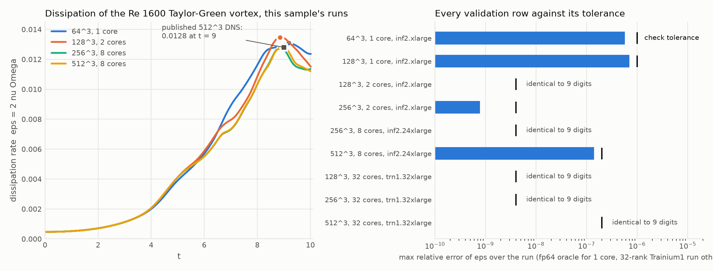
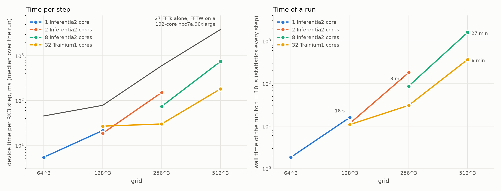

# Results

All runs: Taylor-Green vortex, Re = 1600, dt = 0.5 (2 pi / N), statistics (E, Omega, eps) read back every step, run
to t = 10 unless stated. Dollar figures are the wall time of the run multiplied by the on-demand Linux price of the
whole instance (section 5), whether or not every NeuronCore is used; they exclude instance boot and kernel compile
(5 to 45 s per NEFF, 3 minutes for the 512^3 stage). "median ms/step" is the median over the run's steps of the
device time per step including the readback; "wall" is the whole run from the first to the last step.

Both figures are generated from the runs and references in this repository by `tools/plot_results.py`.

## 1. This sample on Inferentia2 (eu-north-1) and Trainium1 (us-west-2), from the retained runs in `docs/validation/`

| grid | NeuronCores | instance | median ms/step | wall to t = 10 | $ | agreement with the reference | dissipation peak |
|---|---:|---|---:|---:|---:|---|---|
| 64^3 | 1 | inf2.xlarge | 5.41 | 1.9 s | 0.0004 | fp64 oracle: E 2.32e-7, eps 5.73e-7 | 0.0130892 at t = 9.179 |
| 128^3 | 1 | inf2.xlarge | 21.43 | 16.0 s | 0.0037 | fp64 oracle: E 2.74e-7, eps 6.99e-7 | 0.0134553 at t = 8.860 |
| 128^3 | 2 | inf2.xlarge | 18.55 | 11.6 s | 0.0027 | trn1 32-rank CSV: identical to 9 digits | 0.0134552 at t = 8.860 |
| 256^3 | 2 | inf2.xlarge | 151.23 | 181.2 s | 0.042 | trn1 32-rank CSV: E identical, eps 7.85e-10 | 0.0127469 at t = 8.873 |
| 256^3 | 8 | inf2.24xlarge | 73.98 | 87.3 s | 0.17 | trn1 32-rank CSV: identical to 9 digits; second run bitwise identical | 0.0127469 at t = 8.873 |
| 512^3 | 8 | inf2.24xlarge | 749 | 1597 s | 3.17 | trn1 32-rank CSV: E 9.60e-8, eps 1.41e-7 | 0.012773 at t = 8.971 |
| 128^3 | 32 | trn1.32xlarge | 26.8 | 10.9 s | 0.065 | trn1 32-rank CSV: identical to 9 digits | 0.0134552 at t = 8.860 |
| 256^3 | 32 | trn1.32xlarge | 30.0 | 30.8 s | 0.18 | trn1 32-rank CSV: identical to 9 digits | 0.0127469 at t = 8.873 |
| 512^3 | 32 | trn1.32xlarge | 182 | 368 s | 2.20 | trn1 32-rank CSV: identical to 9 digits | 0.012773 at t = 8.971 |

The single-core path (RANKS = 1) is checked against the fp64 NumPy oracle with the same fp32 wavenumber constants;
the multi-core path against the 32-rank Trainium1 runs whose constants are built in fp64 per rank. The two families
differ from each other by 6.8e-6 in E at 128^3 for that reason (`references/README.md`). Where the table says
"identical to 9 digits", every printed value of E and eps (9 significant digits) equals the reference's; the
remaining differences at 256^3 and 512^3 are last-digit effects of a different fp32 summation order (the reference
holds 8192 columns per rank, the 8-rank Inferentia2 run 32768; the 32-rank Trainium1 runs of this kernel have the
reference's column count and reproduce it to every digit). Every run has no NaN, the analytic t = 0 energy and
enstrophy, and -dE/dt within 5 percent of the peak dissipation against 2 nu Omega on every step.

The 8-rank step time on the inf2.24xlarge is bimodal from run to run (a median between 66 and 82 ms at 256^3 across
the retained runs of this kernel and its baseline); the single-core and two-rank times on the inf2.xlarge are stable to
about 1 percent at 256^3.

## 2. Convergence of the dissipation peak

Published 512^3 pseudo-spectral reference (van Rees et al., J. Comput. Phys. 2011; DeBonis, NASA/TM-2013-217850):
peak dissipation about 0.0128 at t about 9.0.

| grid | peak eps | at t | against the reference |
|---|---|---|---|
| 64^3 | 0.01309 | 9.18 | 2 percent high (under-resolved) |
| 128^3 | 0.013455 | 8.860 | 5 percent high, early |
| 256^3 | 0.012747 | 8.873 | 0.4 percent low |
| 384^3 | 0.012731 | 8.967 | (8-rank run of the baseline fused kernel, no Trainium1 reference) |
| 512^3 | 0.012773 | 8.971 | 0.2 percent low, 0.03 early |

## 3. Earlier stage structures on Trainium1 (trn1.32xlarge, 32 NeuronCores, us-west-2)

The reference CSVs come from a two-NEFF stage (exact at 32 ranks on Trainium1, wrong at 8 ranks on Inferentia2, see
[neuron-rules.md](neuron-rules.md), rule 1); a three-NEFF fused stage was measured on the same instance. The
single-NEFF kernel shipped here is faster than both on that instance (section 1: 182 ms per step at 512^3 against
241 and 252) with identical statistics.

| grid | stage | median ms/step | wall to t = 10 with statistics | $ at 21.50/h | peak eps |
|---|---|---:|---:|---:|---|
| 128^3 | 2 NEFFs, 2 all-to-all | 50.9 | 20.8 s | 0.12 | 0.013455 at 8.860 |
| 256^3 | 2 NEFFs | 60.7 | 53.7 s | 0.32 | 0.012747 at 8.873 |
| 512^3 | 2 NEFFs | 241.3 | 463.7 s | 2.77 | 0.012773 at 8.971 |
| 512^3 | 3 fused NEFFs, 3 all-to-all | 252.4 | 488.8 s | 2.92 | 0.012773 at 8.971 |

Each all-to-all across the 16 chips costs about 2 ms whatever its size, so the collective count per stage sets the
scaling: 18 collectives per stage give 229.9 ms per step at 128^3 on 32 ranks, 3 give 79.7 ms, 2 give 50.9 ms.
Strong scaling from 2 to 32 ranks at 256^3 is 2.3x (138.8 to 60.7 ms). The 32-core instance is a wall-clock
machine, not a cost machine: per dollar it loses to the two-core instances at every grid.

## 4. The same step on CPU and GPU

Single device, same algorithm, fp32, execute time per RK3 step; Neuron is the three stage NEFFs on one
NeuronCore-v2 (the same figure on Inferentia2 and Trainium1), GPU is CuPy with cuFFT device-synchronised, CPU is
wall clock. Prices as in section 5. "steps/s per $/h" = 1000 / (ms per step) / ($/h).

| platform | $/h | 64^3 ms/step | steps/s per $/h | 128^3 ms/step | steps/s per $/h | 256^3 ms/step |
|---|---:|---:|---:|---:|---:|---:|
| one Inferentia2 core, inf2.xlarge | 0.834 | 5.2 | 232 | 20.4 | 59 | (152 on both cores) |
| one Trainium1 core, trn1.2xlarge | 1.344 | 5.2 | 144 | 20.4 | 36 | (142 on both cores) |
| L40S, g6e.xlarge, fp32 | 2.699 | 3.6 | 103 | 5.9 | 63 | 123.6 |
| L40S, g6e.xlarge, fp64 | 2.699 | 3.6 | 103 | 25.4 | 15 | 257.9 |
| 8 vCPU c6i.2xlarge, fp32, 8 threads | 0.364 | 66.7 | 41 | 558 | 5 | 6194 |
| 8 vCPU c6i.2xlarge, fp64, 1 thread | 0.364 | 222 | 12 | 3256 | 1 | 26872 |

One NeuronCore-v2 is 1.5x (64^3) to 3.5x (128^3) slower than an L40S per step on a kernel at about 40 percent of
fp32 matmul peak against cuFFT; per dollar the Inferentia2 core delivers 2.3x the GPU's steps at 64^3 and parity at
128^3, and 5 to 12x the CPU. The two-core instances give 1.8x the per-core throughput.

The CPU bar that matters for a pseudo-spectral code is FFTW on a large node: hpc7a.96xlarge (192 AMD EPYC cores,
768 GB, $7.7252/h). "FFT floor" is the 27 three-dimensional fp32 FFTs of one step alone, FFTW on all cores with
measured plans; no pseudo-spectral CPU code on that machine runs a step faster than this.

| grid | Python pipeline ms/step (FFTW or pocketfft, 192 threads) | FFT floor ms/step | Neuron ms/step | Neuron vs floor | steps/s per $/h, Neuron vs hpc7a floor |
|---|---:|---:|---:|---:|---|
| 64^3 | 75 | 45.3 | 5.4 (one inf2 core) | 8.4x | 222 vs 2.9 |
| 128^3 | 389 | 78.3 | 21.4 (one inf2 core) | 3.7x | 56 vs 1.7 |
| 256^3 | 2851 | 600.2 | 151 (inf2.xlarge, 2 cores) | 4.0x | 7.9 vs 0.22 |
| 512^3 | 17756 | 3876.9 | 241 (trn1.32xlarge, 32 cores) | 16x | 0.19 vs 0.033 |

The fp64 FFT floor is 67.8, 247.7, 926.2 and 6456.6 ms. One 128^3 fp32 transform takes 2.9 ms on 192 threads,
about 10 GB/s effective: the FFT's thread scaling on a 3-D transform is what the Neuron kernels beat, not the
arithmetic.

## 5. Prices used (on-demand Linux, 2026-09-18)

| instance | region | $/h |
|---|---|---:|
| inf2.xlarge | eu-north-1 | 0.834 |
| inf2.24xlarge | eu-north-1 | 7.1397 |
| trn1.2xlarge | us-west-2 | 1.344 |
| trn1.32xlarge | us-west-2 | 21.50 |
| g6e.xlarge (L40S) | ap-northeast-1 | 2.699 |
| c6i.2xlarge | eu-north-1 | 0.364 |
| hpc7a.96xlarge | eu-north-1 | 7.7252 |

Trainium2 has no on-demand SKU (Capacity Blocks only) and is out of scope.

## 6. Provenance

Section 1 is this repository's own validation runs (`docs/validation/`). Sections 2 to 4 cite the measurements of
the development programme that produced the kernels; the same-algorithm CPU and GPU implementations and the
Trainium1 runs are not part of this repository.
